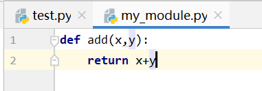
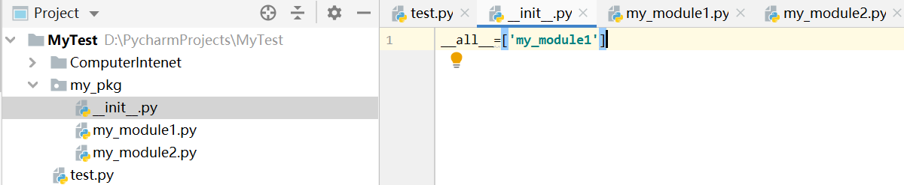

# Python基础

## Python解释器

- 将python代码翻译成二进制文件提交给机器执行
- python解释器在<python安装目录>/python.exe

## 获取数据类型

```python
a=123
x=type(a)
print(x) # <class 'int'>
```

## 数据类型转换

| 语句     | 说明                |
| -------- | ------------------- |
| int(x)   | 将x转换为一个整数   |
| float(x) | 将x转换为一个浮点数 |
| str(x)   | 将对象x转换为字符串 |

## 算术运算符

| 运算符 | 描述   | 实例                               |
| ------ | ------ | ---------------------------------- |
| /      | 除     | 5/2输出结果为2.5，结果一定是浮点数 |
| //     | 取整除 | 5/2输出结果为2                     |
| *      | 乘     | 5*2输出结果为10                    |
| **     | 指数   | 5**2，即5的2次方输出结果为25       |

## 复合赋值运算符

| 运算符 | 实例                  |
| ------ | --------------------- |
| +=     | c+=a等效于c=c+a       |
| -=     | c-=a等效于c=c-a       |
| *=     | c*=a等效于c=c\*a      |
| /=     | c/=a等效于c=c/a       |
| %=     | c%=a等效于c=c%a       |
| **=    | c\*\*=a等效于c=c\*\*a |
| //=    | c//=a等效于c=c//a     |

## 比较运算符

比较的结果为bool类型，即True或者False

- ==
- !=
- \>
- \<
- \>=
- <=

## 引号

- 引号嵌套：单引号内可以写双引号，双引号内可以写单引号

## 字符串

### 字符串拼接

- 字符串与字符串之间通过“+”加号拼接（字符串和整数或浮点数之间不支持）

### 字符串格式化

#### 占位符

```python
mode="好烦"
mode2="真的好烦"
msg="我%s呀，%s"%(mode,mode2)
```

- %表示占位
- %s表示将变量变成字符串放入占位的地方，对于数字是先将数字转成字符串再拼接
- %d将内容转换为整数放入占位的地方
- %f将内容转换为浮点数放入占位的地方

#### 精度控制

m.n来控制数据的宽度和精度，仅对数字有效

- m，控制宽度，设置的宽度小于数字长度时不生效
- n，控制小数点精度，会进行四舍五入
- %5d，如数字11，会变成【空格】【空格】【空格】11，用3个空格补足宽度
- %7.2f，如数字11.345，会变成【空格】【空格】11.35 其中小数点也占一个宽度

#### 快速写法

语法：f"内容{变量}"

- 不限制数据类型，但不能做精度控制

````python
name="Jary"
address="Englend"
time="2023.02.10"
print(f"我是{name},来自{address},现在是{time}")
````

#### 对表达式进行格式化

```python
name="Jary"
print("1*1的结果是：%d"%(1*1))
print(f"1*1的结果是：{1*1}")
print("字符串的类型是%s"%(type('字符串')))
print("字符串的类型是%s"%(type(name)))
```

## 控制台输入

```python
name=input("Who are you?")
print(f"The user is {name}")
```

input函数接收到的字符默认为是字符串类型，其他类型需要自行转换

## 条件判断语句

```python
if 要判断的条件：
	条件成立时要执行的语句
```

```python
if 要判断的条件：
	条件成立时要执行的语句
else：
	条件不成立要执行的语句
```

```python
if 条件1：
	条件1成立要执行的语句
elif 条件2：
	条件1不成立但条件2成立要执行的语句
elif 条件n：
	条件n-1不成立但条件n成立要执行的语句
else：
	以上条件都不满足要执行的语句
```

## 循环语句

### while

```python
a=1
while a<10:
	print(a)
    a+=1
```

### for循环

```python
name = "Jary"
for x in name:
	print(x)
```

#### range函数

- 语法1：range(num)，获取一个从0开始到num结的数字序列（不含num本身）

  ```python
  range(5)#取得的数据为[0,1,2,3,4]
  ```

- 语法2：range(num1,num2)，获取一个从num1开始到num2结束的数字序列（不含num2本身）

  ```python
  range(5,10)#取得的数据为[5,6,7,8,9]
  ```

- 语法3：range(num1,num2,step)，获取一个从num1开始到num2结束的数字序列（不含num2本身）,数字之间的步长以step为准，默认为1

  ```python
  range(5,10,2)#取得的数据为[5,7,9]
  ```

> for循环里的临时变量是可以被访问到的，但这合理，尽量不使用

```python
for  i in range(5):
    a=2
print(i)#输出4
print(a)#输出2
```

### 循环中断

#### continue

中断本次循环，直接进入下一次循环

#### break

跳出循环

## 函数

### 定义

```python
def 函数名(传入参数)：# 括号必须写，参数和返回值可省略
	函数体
	return 返回值
```

```python
def say_hi():
	print("hi")
    
# 调用函数
say_hi()
```

### 参数

#### 位置参数

调用函数时根据函数定义的参数位置来传递参数

```python
def add(x,y):
	print(f"x+y的结果为{x+y}")
```

#### 关键字参数

函数调用时通过“键=值”形式传递参数

当有位置参数时，位置参数必须在关键字参数之前

```python
def user_info(name,age):
	print(f"用户名为{name}，年龄为{age}")
user_info(age=18,name="Jane")
```

#### 默认值参数

定义函数时可以给参数设定默认值，但是这个参数必须放最后否则报错

```python
def user_info(name,age,gender='men'):
	print(f"用户名为{name}，年龄为{age}，性别为{gender}")
user_info(name="Jane",age=18)
```

#### 不定长参数

- 位置不定长参数以\*号标记一个形式参数，一元组的形式接受参数，形式参数一般命名为args

```python
def user_info(num,*args):
	print(f"编号为{num}，{args}")
user_info(1,23,'Tom','men')#编号为1，(23, 'Tom', 'men')
```

- 关键字不定长参数以\*\*号标记形式参数，以字典的形式接受参数，形式参数一般命名为kwargs

```python
def user_info(**kwargs):
	print(f"{kwargs}")
user_info(name="Jane",age=18)#{'name': 'Jane', 'age': 18}
```

#### 函数作为参数传递

传递的是计算逻辑

```python
def test(x,y,compute):
    result=compute(x,y)
    print(result)#3
    print(type(compute))#<class 'function'>

def add(x,y):
    return x+y
test(1,2,add)
```


### 返回值

```python
def add(x,y):
	result=x+y
	return result
	
r=add(4,5)
print(r)
```

> 不管写不写return语句，函数都有返回值，没写的返回None这个字面量，在设计函数时可以主动返回None

```python
def add(x,y):
    print(f"x+y的结果为{x+y}")
    return None
```

#### 多返回值

返回值用逗号隔开，取返回值时按照返回值的顺序写对应顺序的多个变量接收即可，支持不同数据类型的return

```python
def f():
	return 1,2
	
x,y = f()
print(x)#1
print(y)#2
```


### global

将函数内定义的变量 为全局变量

```python
num =200
def test_1():
	num = 1000#局部变量
	print(num)
test_1()# 1000
print(num)#200
def test():
	global num #全局变量
	num =500
	print(num)
	
test()# 500
print(num)#500
```

### 匿名函数

#### 语法

```python
lambda 传入参数：函数体（一行代码）
```

```python
def test(compute):
    result=compute(1,2)
    print(result)#3
    print(type(compute))#<class 'function'>

test(lambda x,y:x+y)

def test(compute,a,b):
    result=compute(a,b)
    print(result)#5
    print(type(compute))#<class 'function'>

test(lambda x,y:x+y,2,3)
```


## 容器

### 列表

- 元素可以修改

#### 定义

```python
#定义常量
[元素1，元素2，元素3，元素4，...]
#定义变量
变量名称=[元素1，元素2，元素3，元素4，...]
#定义空列表
变量名称=[]
变量名称=list()
#定义嵌套列表
my_list=[[1,2,3],[2,4,6],['it',22,True]]
```

#### 下标索引

- 正向索引，下标从0开始，0为列表中的第一个

```python
name_list=['tom','lily','rose']
print(name_list[0])#tom
print(name_list[1])#lily
print(name_list[2])#rose
```

- 反向索引，下标从-1开始，-1为列表中的最后一个

```python
name_list=['tom','lily','rose']
print(name_list[-1])#rose
print(name_list[-2])#lily
print(name_list[-3])#tom
```

- 取嵌套列表的元素

```python
num_list=[[1,2,3],[4,5,6]]
print(num_list[1][1])#5
print(num_list[1][-1])#6
print(num_list[-2][-3])
```

#### 查询功能

查找指定元素在列表的下标，如果找不到，报错ValueError

语法：列表.index(元素)

```python
num_list=[1,3,5]
index = num_list.index(3)
print(index)#1
```

#### 修改元素

- 正向修改

```python
myList=[1,2,3]
myList[0]=9
print(myList)#[9,2,3]
```

- 反向修改

```python
myList=[1,2,3]
myList[-2]=7
print(myList)#[1,7,3]
```

#### 插入元素

语法：列表.insert(下标，元素)，在指定下标处插入指定的元素

```python
myList=[1,2,3]
myList.insert(1,455)
print(myList)#[1,455,2,3]
myList.insert(-4,24)
print(myList)#[24,1,455,2,3]
```

#### 追加元素

- 方式一

  语法：列表.append(元素)，将指定元素追加到列表的尾部

```python
myList=[1,2,3]
myList.append(4)
print(myList)#[1,2,3,4]
```

- 方式二

  语法：列表.extend(其他数据容器)，将其他数据容器的内容取出，依次追加到列表尾部

```python
myList=[1,2,3]
myList.extend([4,5,6])
print(myList)#[1,2,3,4,5,6]
```

#### 删除元素

- 方式一：

  语法：del列表[下标]

```python
myList=[1,2,3]
del myList[1]
print(myList)#[1,3]
```

- 方式二：

  语法：列表.pop(下标)，同时将删除的元素取出

```python
myList=[1,2,3]
p=myList.pop(-1)
print(myList)#[1,2]
print(p)#3
```

- 方式三：

  语法：列表.remove(元素)，删除某元素在列表中的第一个匹配项

```python
myList=[1,2,3,4,2,1]
myList.remove(2)
print(myList)#[1,3,4,2,1]
```

#### 清空列表

语法：列表.clear()

```python
myList=[1,2,3,4,2,1]
myList.clear()
print(myList)#[]
```

#### 统计某元素在列表中的数量

语法：列表.count(元素)

```python
myList=[1,2,3,4,2,1,2]
count = myList.count(2)
print(count)#3
```

#### 统计列表中总共有多少元素

语法：len(列表)

```python
myList=[1,2,3,4,2,1,2]
count = len(myList)
print(count)#7
```

#### 遍历列表

```python
def list_while():
    i = len(myList)
    j = 0
    while j<i:
        print(myList[j],end=' ')
        j+=1

def list_for():
    for a in myList:
        print(a,end=' ')
myList=[21,25,21,23,22,20]
list_while()
print()
list_for()
```

### 元组

- 基本元素不可以修改，但可以修改对象元素的内部元素，比如元组里嵌套的列表可以增删改元素

#### 定义

- 当元组只有一个基本类型元素时，这个元素后面必须添加逗号,

  ```python
  my_tuple=(1)
  print(type(my_tuple)) #<class 'int'>
  my_tuple=(1,)
  print(type(my_tuple)) #<class 'tuple'>
  my_tuple=((1,2,3))
  print(type(my_tuple)) #<class 'tuple'>
  ```

  

```python
#定义常量
(元素1，元素2，元素3，元素4，...)
#定义变量
变量名称=(元素1，元素2，元素3，元素4，...)
#定义空元组
变量名称=()
变量名称=tuple()
#定义一个元素的元组
my_tuple=(1,)
#定义嵌套元组
my_tuple=((1,2,3),(2,4,6),('it',22,True))
```

#### 下标索引

同列表

```python
t=((1,2,3),(4,5,6))
print(t[1][2])#6
```

#### 相关操作

| 方法      | 功能                                                         |
| --------- | ------------------------------------------------------------ |
| index()   | 查找某个元素，如果数据存在则返回该元素的第一个下标，否则报错 |
| count()   | 统计某个元素在当前元组中出现的次数并返回                     |
| len(元组) | 统计元组内元素的个数并返回                                   |

#### 遍历元组

```python
def tuple_while():
    i = len(mytuple)
    j = 0
    while j<i:
        print(mytuple[j],end=' ')
        j+=1

def tuple_for():
    for a in mytuple:
        print(a,end=' ')
mytuple=(21,25,21,23,22,20)
tuple_while()
print()
tuple_for()
```

### 字符串容器

#### 下标索引

- 不允许通过下标进行修改字符串

```python
strs="england"
print(strs[1])#n
print(strs[-1])#d
```

#### index操作

- 查找与给定字符的第一个匹配项的下标

```python
strs="england"
print(strs.index('g'))#2
```

#### 替换操作

- 替换所有，原字符串不变，其实是产生新的字符串

```python
strs="england"
str2=strs.replace('n','a')
print(str2)#eaglaad
print(strs)#england
```

#### split操作

```python
strs=" england is aaa b "
str2=strs.split(" ")
print(str2)#['', 'england', 'is', 'aaa', 'b', '']
print(type(strs))#<class 'str'>
```

#### strip 方法

- 不传参数时是默认去除首尾空白字符
- 传参数时是去除首尾与该参数相似的字符

```python
strs=" england is aaa b "
str2=strs.strip()
print(str2)#england is aaa b
strs="132england is aaa b231"
str2=strs.strip("123")
print(str2)#england is aaa b
strs="1342england is aaa b231"
str2=strs.strip("123")
print(str2)#42england is aaa b
```

#### 统计字符串中某字符出现的次数

```python
strs=" england is aaa b "
print(strs.count('a'))#4
```

#### 统计字符串长度

```python
strs=" england is aaa b "
print(strs.count('a'))
```

### 切片

语法：序列[起始下标:结束下标:步长]

- 起始下标留空视为从头开始，可以大于元素个数且不会越界
- 结束下标（不含）留空视为截取到结束，可以大于元素个数且不会越界
- 步长：步长为N表示取完第一个后每次跳过N-1个元素取，步长默认为1可以不写，步长为负数表示反向取（此时起始下标大于结束下标时才有效，即从后往前取），步长可以大于元素个数不会越界

- 序列切片不影响原序列，而是生成一个新序列

```python
myList=[1,2,3,4,5,6]
print(myList[1:4])#从1开始到4结束步长为1：[2, 3, 4]
myTuple=(1,2,3,4,5,6)
print(myTuple[:])#从头开始到最后结束步长为1:(1, 2, 3, 4, 5, 6)
myStr="123456"
print(myStr[::2])#从头开始到最后结束步长为2：135
print(myStr[::-1])#从头开始到最后结束步长为-1:654321
print(myList[-4:-6:-1])#[3, 2]
print(myList[3:5:-1])#[]
print(myList[5:3:-1])#[6, 5]
print(myList[1:1])#[]
```

### 集合

不允许重复且内容无序，不支持下标索引

#### 定义

```python
{元素，元素，...元素}
变量名称={元素，元素，...元素}
变量名称=set()#空集合,不支持变量名称={}这种定义方式
```

#### 操作

```python
mySet = set()
# 添加新元素
mySet.add("Python")
mySet.add("I")
mySet.add("hate")
mySet.add("I")
mySet.add("you")
print(mySet)  # {'hate', 'Python', 'I', 'you'}
# 移除元素
mySet.remove("Python")
print(mySet)  # {'you', 'I', 'hate'}
# 随机取出一个元素
e = mySet.pop()
print(e)#you
print(mySet)#{'hate', 'I'}
#清空集合
mySet.clear()
print(mySet)#set()
# 取两个集合的差集
mySet1={1,3,4,2,6}
mySet2={1,3,7,8}
mySet3=mySet1.difference(mySet2)
print(mySet1)#{1, 2, 3, 4, 6}
print(mySet2)#{8, 1, 3, 7}
print(mySet3)#{4,2,6}
#消费一个集合与另一个集合重复的部分
mySet1.difference_update(mySet2)
print(mySet1)#{2, 4, 6}
print(mySet2)#{8, 1, 3, 7}
#2个集合合为一个
mySet3=mySet1.union(mySet2)
print(mySet3)#{1, 2, 3, 4, 6, 7, 8}
#统计集合元素数量
count=len(mySet3)
print(count)#7
#集合的遍历，不支持下标索引也就不支持while遍历因为会修改原集合
for e in mySet3:
    print(e,end=' ')
# i=0
# while i<count:
#     print(mySet3.pop(),end=' ')
#     i+=1

```

### 字典

key不能存字典类型，value支持任何类型 

key值不允许重复，重复添加相当于覆盖原有数据，value可以为None，是有序的，根据不存在的key取值会报错

#### 定义

```python
#定义字典变量
变量名称={key:value,key:value,...key:value}
#定义空字典
变量名称={}
变量名称=dict()
```

#### 操作

```python
myDict={'python':88,'java':99,'c':None,'c++':99}
print(myDict)
#取值,根据不存在的key取值会报错
print(myDict['python'])#88
print(myDict['java'])#99
print(myDict['c'])#None
# print(myDict['c#'])#报错
#新增元素
myDict['mysql']=100
print(myDict)#{'python': 88, 'java': 99, 'c': None, 'c++': 99, 'mysql': 100}
#更新元素
myDict['c']=96
print(myDict)#{'python': 88, 'java': 99, 'c': 96, 'c++': 99, 'mysql': 100}
#删除元素
v = myDict.pop('python')
print(v)#88
print(myDict)#{'java': 99, 'c': 96, 'c++': 99, 'mysql': 100}
del myDict['java']
print(myDict)#{'c': 96, 'c++': 99, 'mysql': 100}
#清空元素
# myDict.clear()
# print(myDict)#{}
#获取字典的全部key
keys=myDict.keys()
print(keys)#dict_keys(['c', 'c++', 'mysql'])
#遍历字典,不支持下标索引所以不支持while循环
for k in keys:
    print(myDict[k],end=' ')
print()
for key in myDict:
    print(myDict[key],end=' ')
print()
#获取字典中的元素数量
num = len(myDict)
print(num)#3
```

### 容器通用操作

| 函数                          | 说明                                                         |
| ----------------------------- | ------------------------------------------------------------ |
| len(容器)                     | 取容器中元素的个数                                           |
| max(容器)                     | 取容器中最大的元素，对于字典比较的是key值                    |
| min(容器)                     | 取容器中最小的元素，对于字典比较的是key值                    |
| list(容器)                    | 将元组、字符串、集合、字典转成列表类型，其中字符串是每个字母拆分成一个元素，字典是只保留了key值 |
| tuple(容器)                   | 将列表、字符串、集合、字典转成元组类型，其中字符串是每个字母拆分成一个元素，字典是只保留了key值 |
| str(容器)                     | 将列表、元组、集合、字典转成字符串类型，字典的key值和value值都保存了，列表有加中括号，元组有加小括号，集合和字典有加大括号 |
| set(容器)                     | 将列表、字符串、元组、字典转成集合类型，其中字符串是每个字母拆分成一个元素，字典是只保留了key值 |
| sorted(容器，[reverse=False]) | 将给定容器进行排序，希望逆序时将reverse设置为true默认为false，排序后的结果为列表对象，字典是按照key值排序会丢失value |
| 通用for循环                   | 遍历容器                                                     |

### 排序

语法：容器.sort(key=选择排序依据的函数，reverse=True|False)

- key：要求传入一个函数，表示将容器的每一个元素都传入到函数中，返回排序的依据
- reverse：True为降序，False为升序

```python
# 嵌套列表，要求对外层列表进行排序，排序依据是内层列表的元素的第二个元素数字
my_list=[['a',33],['b',55],['c',11]]
# 定义排序方法 element为my_list中的每一个元素例如['a',33]
def choose_sort_key(element):
    return element[1]

my_list.sort(key=choose_sort_key,reverse=True)
print(my_list)#[['b', 55], ['a', 33], ['c', 11]]
#改为lambda形式
my_list.sort(key=lambda element:element[1],reverse=False)
print(my_list)#[['c', 11], ['a', 33], ['b', 55]]
```


## 文件

### 打开文件

使用open()打开函数

语法：open(name,mode,encoding)

- name：要打开的目标文件名（可以包含文件所在的具体路径）
- mode：设置打开文件的模式：只读r、写入w（如果文件已存在则从头写入，如果不存在则创建新文件写）、追加写a（如果文件已存在则追加写，如果不存在则创建新文件写）等
- encoding：编码格式（推荐使用UTF-8）

```python
#encoding的顺序不是第3位所以不能用位置参数，用关键字参数指定
f=open('python.txt','r',encoding=UTF-8)
#for循环读取文件
for line in f:
    print(f"每一行数据为{line}")
f.close()
#不手动关闭文件的写法
with open('python.txt','r') as f:
    f.readlines()

```

### 操作

文件读取当没有关闭文件时每次读取都是续接上一次读取函数的内容

| 操作                                          | 功能                                                         |
| --------------------------------------------- | ------------------------------------------------------------ |
| 文件对象=open(filename,mode,encoding)         | 打开文件获得文件对象                                         |
| 文件对象.read(num)                            | num表示要从文件中读取的数据的长度（字节），如果没有传入num则表示读取文件中所有数据 |
| 文件对象.readlines()                          | 按照行的方式将文件中的内容进行一次性读取，并且返回的是一个列表，每一行的数据为一个元素，换行符以\n的形式呈现 |
| 文件对象.readline()                           | 一次读取一行，换行符会被吃掉                                 |
| 文件对象.close()                              | 关闭文件，否则文件会被一直占用，内置了flush功能              |
| with open(文件地址，读取模式，编码方式) as f: | 可以在操作完成后自动关闭close文件                            |
| 文件对象.wirte(想写入的内容)                  | 写入文件，其实是将内容写入到内存缓冲区中，避免频繁的操作硬盘 |
| 文件对象.flush()                              | 刷新文件，将写入到内存中的内容写入到磁盘中                   |

## 异常

### 捕获常规异常

```python
try:
	可能出现错误的代码
except:
	如果出现异常希望执行的代码
    
try:
    f=open('abc.txt','r')
except:
    f=open('abc.txt','w')
```

### 捕获指定异常

```python
try:
    可能出现错误的代码
except 异常名称 as e:
    如果出现异常希望执行的代码
    
try:
    print(a)
except NameError as e:
    print("出现了变量未定义的异常")
    print(e)#输出异常的具体信息
```

### 捕获多个异常

```python
try:
    可能出现错误的代码
except (异常名称1,异常名称2) as e:
    如果出现异常希望执行的代码
    
try:
    print(a)
    #1/0
except (NameError,ZeroDivisionError) as e:
    print("出现了变量未定义的异常 或者除数为0的异常")
    print(e)#输出异常的具体信息
```

### 捕获全部异常

```python
try:
    f=open('abc.txt','r')
except:
    f=open('abc.txt','w')

try:
    print(a)
    #1/0
except Exception as e:
    print(e)#输出异常的具体信息
```

### 异常else

```python
try:
    print(a)
    #1/0
except Exception as e:
    print(e)#输出异常的具体信息
else:
    print("没有出现异常")
```

### 异常的finally

finally表示的是无论是否发生异常都要执行的代码，例如关闭文件

```python
try:
    f=open('abc.txt','r')
except Exception as e:
    f=open('abc.txt','w')
else:
    print("没有出现异常")
finally:
    f.close()
```

### 异常的传递

异常具有传递性，在函数的嵌套调用中，如果内层函数没有捕获异常那么异常会被抛到外层函数去捕获，如果最外层函数也没有捕获异常，则会抛出到控制台中显示出来

## 模块

模块是一个python文件，以.py结尾，模块能定义函数，类和变量，模块也能包含可执行的代码

### 模块的导入方式

语法：[from 模块名] import [模块|类|变量|函数|*] [as 别名]

常用组合：

- import 模块名1，模块名2
- from 模块名 import 类、变量、方法等
- from 模块名 import *
- import 模块名 as 别名
- from 模块名 import 功能名 as 别名

```python
import time
print('开始')
time.sleep(1)
print('结束')
```

### 自定义模块

新建一个Python文件，命名为my_module.py，并定义test函数




- 当引用的多个模块中有同名函数或者类或者变量时，实际使用的是后引用的模块里的，就近原则

- 若引用的模块为可执行程序，那么在引用的时候会执行该模块的可执行代码，此时可以在模块中加一个判断

  

#### 指定允许导入的函数、类或变量

如果一个模块文件中有\__all\_\_变量，当使用`from xxx import * `导入时，只能导入这个列表中的元素


## 包

- 在物理上，包就是一个文件夹，在该文件夹下包含了一个`__init__.py`文件，该文件夹可用于包含多个人模块文件

- 在逻辑上，包的本质依然是模块
- 当我们需要引用的模块文件越来越多时，包可以帮我们管理这些模块

### 导入包

语法：import 包名.模块名 

使用：包名.模块名.目标


```python
# import my_pkg.my_module1
# import my_pkg.my_module2
# my_pkg.my_module1.info_print1()
# my_pkg.my_module2.info_print2()

# 使用时不需要写包名的导入方式
# from my_pkg import my_module1
# from my_pkg import my_module2
# my_module1.info_print1()
# my_module2.info_print2()

# 使用时不需要写模块名的导入方式
from my_pkg.my_module1 import info_print1
from my_pkg.my_module2 import info_print2
info_print1()
info_print2()

```

方式二：

在`__init__.py`文件中添加`__all__=[]`，控制允许导入的模块列表

from 包名 import *

模块名.目标



```python
#通过__all__变量控制import*
from my_pkg import *
my_module1.info_print1()
my_module2.info_print2()#报错
```

### 安装第三方包

语法：`pip install 包名`

使用清华网站下载：`pip install -i https://pypi.tuna.tsinghua.edu.cn/simple 包名称`

## JSON

JSON数据可以与Python列表、字典相互转换

```python
import json

#将列表转换为json字符串
data=[{'name':'Tom','age':11},{'name':'Jack','age':15},{'name':'Candy','age':14}]
json_str=json.dumps(data,ensure_ascii=False)#不使用ASCII码转换中文
print(type(json_str))#<class 'str'>
print(json_str)

#将字典转换为json字符串
d={'name':'Jack','age':15}
json_str = json.dumps(d,ensure_ascii=False)
print(type(json_str))#<class 'str'>
print(json_str)

#将JSON数据转为列表
s='[{"name": "Tom", "age": 11}, {"name": "Jack", "age": 15}, {"name": "Candy", "age": 14}]'#注意json内部只能用双引号
l = json.loads(s)
print(type(l))#<class 'list'>
print(l)

#将JSON数据转为字典
s='{"name": "Jack", "age": 15}'
l = json.loads(s)
print(type(l))#<class 'dict'>
print(l)
```

## pyechars入门

```python
from pyecharts.charts import Line
#创建一个折线图对象
line = Line()
#添加X轴数据
line.add_xaxis(['中国','美国','英国'])
#添加Y轴数据
line.add_yaxis('GDP',[30,20,10])
#生成图表
line.render()
```


### 全局配置

```python
from pyecharts.charts import Line
from pyecharts.options import TitleOpts,LegendOpts,ToolboxOpts,VisualMapOpts
#创建一个折线图对象
line = Line()
#添加X轴数据
line.add_xaxis(['中国','美国','英国'])
#添加Y轴数据
line.add_yaxis('GDP',[30,20,10])
#设置全局配置项
line.set_global_opts(
    title_opts=TitleOpts(title='GDP展示',pos_left='center',pos_bottom='1%'),#标题
    legend_opts=LegendOpts(is_show=True),#图例
    toolbox_opts=ToolboxOpts(is_show=True),#工具箱
    visualmap_opts=VisualMapOpts(is_show=True)#视觉映射
)
#生成图表
line.render()
```


### 时间线绘图

```python
from pyecharts.charts import Bar,Timeline
from pyecharts.options import LabelOpts
from pyecharts.globals import ThemeType

bar1= Bar()
bar1.add_xaxis(['中国','英国','美国'])
bar1.add_yaxis("GDP",[30,20,30],label_opts=LabelOpts(position='right'))
bar1.reversal_axis()

bar2=Bar()
bar2.add_yaxis('GDP',[50,30,40],label_opts=LabelOpts(position='right'))
bar2.add_xaxis(['中国','英国','美国'])
bar2.reversal_axis()

bar3=Bar()
bar3.add_xaxis(['中国','英国','美国'])
bar3.add_yaxis('GDP',[70,55,65],label_opts=LabelOpts(position='right'))
bar3.reversal_axis()

#时间线对象
timeLine = Timeline(
    {'theme':ThemeType.LIGHT}
)
#在时间线内添加柱状图对象
timeLine.add(bar1,'点1')
timeLine.add(bar2,'点2')
timeLine.add(bar3,'点3')

#自动播放设置
timeLine.add_schema(
    play_interval=1000,#自动播放的时间间隔，单位毫秒
    is_timeline_show=True,#是否在自动播放时显示时间线
    is_auto_play=True,#是否自动播放
    is_loop_play=True#是否循环自动播放
)
#主题设置

#此时绘图是用时间线对象而不是bar了
timeLine.render('GDP分析图.html')
```


## 类

### 类的定义

语法：

```python
class 类名称:
	类的属性(变量)
	类的行为(函数)
```

创建类对象：对象名=类名称()

### 成员方法

语法：

```python
def 方法名(self,形参1,...形参N):
	方法体
```

其中self是必写关键字

- 它用来表示类对象自身的意义
- 当我们使用类对象调用方法时，self会被自动Python传入

- 在方法内部，想要访问类的成员变量，必须使用self

```python
class Student:
    name = None
    def say_hi(self):
        print(f"hello, my name is {self.name}")
    def say_hi2(self,msg):
        print(f"hello, {msg}")

s = Student()
s.name='Jane'
s.say_hi()#hello, my name is Jane
s.say_hi2('Kate')#hello, Kate
```

### 构造方法

python类的构造方法为`__init__()`

在创建类对象时会自动执行构造方法，传入的参数会自动传递给`__init__`方法使用

```python
class Student:
    name = None
    age =None

    def __init__(self,name, age):
        self.name=name
        self.age=age
        print('Student create an instance')

stu =Student(name='Jack',age=32)
print(stu.name)#Jack
print(stu.age)#32
```

### 魔术方法

#### `__str__`

相当于Java的toString函数

```python
class Student:
    name = None
    age =None

    def __init__(self,name, age):
        self.name=name
        self.age=age
        print('Student create an instance')

    def __str__(self):
        return f'Student(name={self.name},age={self.age})'

stu =Student(name='Jack',age=32)
print(stu)#Student(name=Jack,age=32)
```

#### `__lt__`

直接对两个对象进行比较是不可以的，需要在类中实现`__lt__`方法，即同时完成大于符号和小于符号2种比较

```python
class Student:
    name = None
    age =None

    def __init__(self,name, age):
        self.name=name
        self.age=age
        
    def __lt__(self, other):
        '''
        比较大小
        :param other:另一个需要比较的对象
        :return: True或False
        '''
        return self.age<other.age
stu =Student(name='Jack',age=32)
stu2=Student(name='Kate',age=29)
print(stu<stu2)#False
print(stu>stu2)#True
```

#### `__le__`

可用于<=、>=比较运算上

```python
class Student:
    name = None
    age =None

    def __init__(self,name, age):
        self.name=name
        self.age=age

    def __le__(self, other):
        '''
        比较大小
        :param other:另一个需要比较的对象
        :return: True或False
        '''
        return self.age<=other.age
stu =Student(name='Jack',age=32)
stu2=Student(name='Kate',age=29)
print(stu<=stu2)#False
print(stu>=stu2)#True
```

#### `__eq__`

相当于Java的equals方法

```python
class Student:
    name = None
    age =None

    def __init__(self,name, age):
        self.name=name
        self.age=age

    def __eq__(self, other):
        '''
        比较是否相等
        :param other:另一个需要比较的对象
        :return: True或False
        '''
        return self.age==other.age
stu =Student(name='Jack',age=32)
stu2=Student(name='Kate',age=29)
print(stu==stu2)#False
```

- 不实现这个方法的话，对象之间可以比较，但比较的是内存地址，不同对象==比较一定是False
- 实现这方法，就可以按照不同需求去比较对象了

### 封装

#### 私有成员

定义：变量名或者方法名以两个下划线开头

私有的成员变量和方法只能在类中使用

```python
class Student:
    __name = None
    __age =None
    def __say_hi(self):
        print(f'hello,{self.__name}')
    def __init__(self,name, age):
        self.__name=name
        self.__age=age
        self.__say_hi()

stu =Student(name='Jack',age=32)#hello,Jack
```

### 继承

子类从父类继承父类的非私有的成员变量和方法

#### 单继承

语法：

```python
class 类名(父类名):
	类内内容
```

```python
#父类
class Phone:
    IMEI=None
    producer=None

    def call_by_4g(self):
        print('4g calling')

#子类
class Phone2023(Phone):
    face_id=True
    def call_by_5g(self):
        print('5g calling')
```

#### 多继承

一个类继承多个类

当多个父类中有同名的成员时，默认以继承顺序（从左往右）为优先级，即保留先继承的

语法：

```python
class 类名(父类1,父类2,...父类N):
	类内内容
```

#### 复写

当对继承来的成员变量或者方法不满意时，可以进行复写，即在子类中重新定义同名的属性或方法

#### 在子类中调用父类的成员变量和方法

```python
#父类
class Phone:
    IMEI=None
    producer='IT'

    def call_by_5g(self):
        print('4g calling')

#子类
class Phone2023(Phone):
    face_id=True
    producer = 'HM'
    def call_by_5g(self):
        #方法1
        print(f'父类的producer为{Phone.producer}')#父类的producer为IT
        Phone.call_by_5g(self)#self必须传 4g calling
        #方法2
        print(f'父类的producer为{super().producer}')  # 父类的producer为IT
        super().call_by_5g()#4g calling
        print('5g calling')#5g calling

p = Phone2023()
p.call_by_5g()
```

### 类型注解

#### 对变量进行类型注解

语法：`变量：类型`

```python
a:int =10
class Student:
	pass
stu:Student = Student()
#容器注解
my_list:list=['it',888,True]
my_dict:dict={'it':888,'su':999}
    
#在注释中进行类型注解 语法：  type:类型
import random
import json
a=random.randint(1,10)#type:int
d = json.loads(data)#type:dict
```

#### 对形参进行类型注解

语法：

```python
def 函数方法名(形参名:类型,形参名:类型):
	pass
```

```python
def func(data:list):
	pass
```

#### 对返回值进行类注解

语法：

```python
def 函数方法名(形参名:类型,形参名:类型)->返回类型:
	pass
```

```python
def func(data:list)->list:
	return data
```

#### Union类型

语法：

```python
Union[类型,...,类型]
```

```python
from typing import Union
my_list:list[Union[str,int]]=[1,2,'it']
my_dict:dict[Union[str,int]]={'name':'Jack','age':21}
def func(data:Union[str,int])->Union[int,str]:
	return data
```

### 多态

完成某个行为时，使用不同的对象会得到不同的状态


             

## pymysql

### 连接数据库

```python
from pymysql import Connection
#获取mysql数据库的连接对象
conn = Connection(
    host='localhost',
    port=3306,
    user='root',
    password='root'
)
print(conn.get_server_info())
```

### 执行SQL语句

```python
from pymysql import Connection
#获取mysql数据库的连接对象
conn = Connection(
    host='localhost',
    port=3306,
    user='root',
    password='root'
)
print(conn.get_server_info())
#获取游标对象
cursor=conn.cursor()
conn.select_db('test')#选择数据库
#使用游标执行sql语句
# cursor.execute('create table test_pymydql(id int, info varchar(255));')
cursor.execute('select * from test_pymydql')
#获取查询结果
result:tuple=cursor.fetchall()
for r in result:
    print(r)
conn.close()
```

### 数据插入

pymsql在执行数据插入或其他产生数据更改的SQL语句时，默认是需要提交更改的，调用commit方法，或者设置自动提交

```python
from pymysql import Connection
#获取mysql数据库的连接对象
conn = Connection(
    host='localhost',
    port=3306,
    user='root',
    password='root',
    autocommit=True#自动提交数据更改
)
print(conn.get_server_info())
#获取游标对象
cursor=conn.cursor()
conn.select_db('test')#选择数据库
#使用游标执行sql语句
# cursor.execute('create table test_pymydql(id int, info varchar(255));')

#插入数据
cursor.execute('insert into test_pymydql values(11,"插入数据")')
# conn.commit()
cursor.execute('select * from test_pymydql')
#获取查询结果
result:tuple=cursor.fetchall()
for r in result:
    print(r)
conn.close()
```

## 闭包

在函数嵌套的前提下，内部函数使用了外部函数的变量，并且外部函数返回了内部函数，我们把这个使用外部函数变量的内部函数称为闭包


```python
def outer(logo):
    def inner(msg):
        print(f"<{logo}>{msg}")

    return inner
fn1 = outer('外部函数')#此时调用了外部函数，但是并没有执行内部函数，什么都没有输出，但是把内部函数返回了
fn1('调用内部函数')#<外部函数>调用内部函数

fn2=outer('kkk')
fn2(',,,')#<kkk>,,,
```

### nonlocal

使用nonlocal关键字修饰的外部函数变量才能在内部函数中修改它

```python
def outer(num1):
    def inner(num2):
        nonlocal num1
        num1+=num2
        print(num1)

    return inner
num = 2
fn1 = outer(num)
fn1(3)#5
fn1(2)#7
```

### 优缺点


### 装饰器

装饰器就是使用创建一个闭包函数，在闭包函数内调用目标函数，达到不改动目标函数的同时，增加额外的功能，有点像Spring里的面向切面编程


语法糖写法：


## 单例模式

str_tools.py文件

```python
class StrTool:
    pass
str = StrTool()
```

test.py文件

```python
from str_tools import str
s1 = str
s2 = str
print(s1==s2)#True
```

## 工厂模式


优点


## 多线程编程

```python
import threading
thread_obj=threading.Thread([group[,target[,name[,args[,kwargs]]]]])
- group:暂时无用，未来功能的预留参数
- target：执行的目标任务名
- args：以元组的方式给执行任务传参
- kwargs：以字典方式给执行任务传参
- name：线程名，一般不用设置
#启动线程，让线程开始工作
thread_obj.start()
```

```python
import threading
import time
def sing(msg1,msg2):
    while True:
        print(msg1)
        print(msg2)
        time.sleep(1)

def dance(msg):
    while True:
        print(msg)
        time.sleep(1)

if __name__ == '__main__':
    sing_thread = threading.Thread(target=sing,args=('哈哈哈','你好',))
    dance_thread = threading.Thread(target=dance,kwargs={'msg':'国防'})
    sing_thread.start()
    dance_thread.start()
```

## Socket通信

### 服务端

1. 创建Socket

   ```python
   import socket
   socket_server = socket.socket()
   ```

2. 绑定到指定IP和地址

   ```python
   socket_server.bind(host,port)
   ```

3. 服务端开始监听端口

   ```python
   socket_server.listen(backlog)
   #backlog为int整数，表示允许连接的数量，超出会等待，可以不填，不填会自动设置一个合理值
   ```

4. 接收客户端连接，获取连接对象

   ```python
   conn,address=socket_server.accept()
   #accept是阻塞方法，如果没有连接，会卡在这一行不向下执行
   #accept返回的是一个二元元组，用两个变量接收二元元组的2个元素
   ```

5. 客户端连接后，通过recv方法，接收客户端发送的消息

   ```python
   while True:
   	data = coon.recv(1024).decode('UTF-8')#recv为阻塞方法
   	#recv方法的返回值是字节数组（Bytes），可以通过decode使用UTF-8解码为字符串
   	#recv方法的传参是buffsize，缓冲区大小
   	if data == 'exit':
   		break
   	print('接收到的数据为：',data)
   ```

6. 通过conn（客户端当次连接对象），调用send方法返回可以回复消息

   ```python
   while True:
   	data = conn.recv(1024).decode('UTF-8')
   	if data == 'exit':
   		break
   	print('接收到的数据为：',data)
   	
   	conn.send('你好'.encode('UTF-8'))
   ```

7. conn和socket_server对象调用close方法关闭连接

   ```python
   conn.close()
   socket_server.close()
   ```

### 客户端

1. 创建socket对象

   ```python
   import socket
   socket_client = socket.socket()
   ```

2. 连接到服务端

   ```python
   socket_client.connect((服务器ip地址，端口))
   ```

3. 发送消息

   ```python
   while True:
   	send_msg=input('请输入消息').encode('UTF-8')
   	if send_msg=='exit':
   		break
   	socket_client.send(send_msg)
   ```

4. 接收返回消息

   ```python
   while True:
   	send_msg=input('请输入消息').encode('UTF-8')
   	if send_msg=='exit':
   		break
   	socket_client.send(send_msg)
   	
   	recv_data = socket_client.recv(1024)#recv为阻塞方法，即不接收到返回的消息就卡在这里等待
   	print('服务器端返回的消息为：',recv_data)
   ```

5. 关闭连接

   ```python
   socket_client.close()
   ```

## 正则表达式

